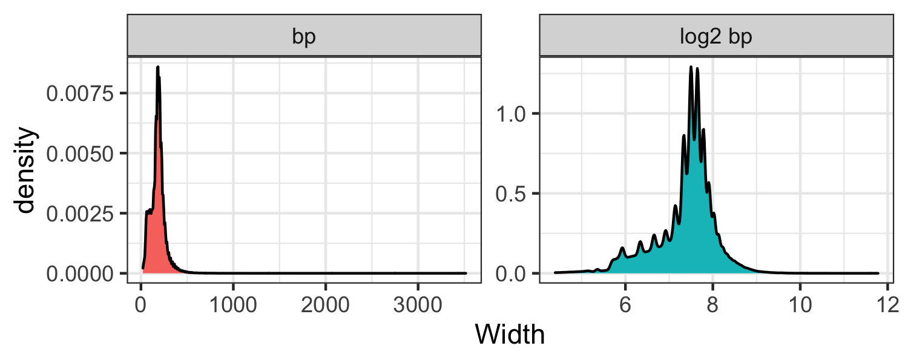
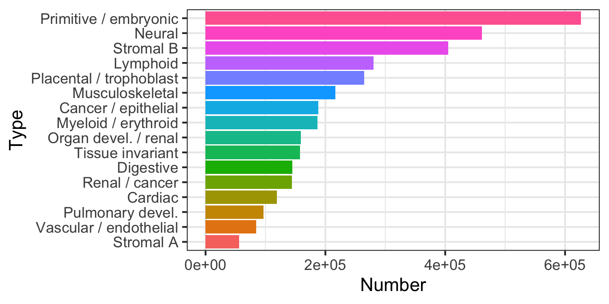

```{r setup, include = FALSE}
knitr::opts_chunk$set(
    collapse = TRUE,
    comment = "#>",
    crop = NULL ## Related to https://stat.ethz.ch/pipermail/bioc-devel/2020-April/016656.html
)
```


```{r vignetteSetup, echo=FALSE, message=FALSE, warning = FALSE}
## Track time spent on making the vignette
startTime <- Sys.time()

## Bib setup
library("RefManageR")

## Write bibliography information
bib <- c(
    R = citation(),
    BiocStyle = citation("BiocStyle")[1],
    knitr = citation("knitr")[1],
    RefManageR = citation("RefManageR")[1],
    rmarkdown = citation("rmarkdown")[1],
    sessioninfo = citation("sessioninfo")[1],
    # testthat = citation("testthat")[1],
    allowranges = citation("allowranges")[1]
)
```

# Basics

`r BiocStyle::Biocpkg("allowranges")` is  an experimental data package, to be submitted 
as an AnnotatiohHub Bioconductor package.

`r BiocStyle::Biocpkg("allowranges")` contains genomic coordinates of DNAse I hypersensitive sites for multiple call- and tissue types. See Meuleman, Wouter, Alexander Muratov, Eric Rynes, Jessica Halow, Kristen Lee, Daniel Bates, Morgan Diegel, et al. “[Index and Biological Spectrum of Human DNase I Hypersensitive Sites](https://doi.org/10.1038/s41586-020-2559-3).” Nature, July 29, 2020. Data source: https://www.meuleman.org/research/dhsindex/
 
BED-like files of cell- and tissue type-specific DNAse I hypersensitive regions 
are available on the [Annotated regulatory Index](https://www.meuleman.org/research/dhsindex/)
website. Human (hg38) regions are available.
The purpose of this package is to provide a unified 
place for informed retrieval of biologically active regions.
Cross-reference package: [denyranges](https://github.com/mdozmorov/denyranges)

Naming convention: `<genome assembly>.<lab>.<original file name>`, e.g.,
`hg38.Meuleman.Cancer_epithelial`.

`r BiocStyle::Biocpkg("allowranges")` package currently contains 16 Rds objects. 

Download the full data from the [Google Drive folder](https://drive.google.com/drive/folders/14yHnVLZ2XDEOkVufgAyjKJ66Sjmt25eG?usp=sharing)

See [../inst/scripts/make-data.R](inst/scripts/make-data.R) how to create the allowranges 
GRanges objects.

| Object                                  | Number of regions | Assembly | Lab      | Number of columns | Source                                      | Type                    | Description                                | Direct link                                                                                                                 |
|-----------------------------------------|-------------------|----------|----------|-------------------|---------------------------------------------|-------------------------|--------------------------------------------|-----------------------------------------------------------------------------------------------------------------------------|
| hg38.Meuleman.Cancer_epithelial.rds     | 188489            | hg38     | Meuleman | 10                | https://www.meuleman.org/research/dhsindex/ | Cancer / epithelial     | DNAse I regions in Cancer / epithelial     | [hg38.Meuleman.Cancer_epithelial.rds](https://drive.google.com/uc?export=download&id=1CdaSUr45IbmDicegz0TPITcOO41e2MaT)     |
| hg38.Meuleman.Cardiac.rds               | 118869            | hg38     | Meuleman | 10                | https://www.meuleman.org/research/dhsindex/ | Cardiac                 | DNAse I regions in Cardiac                 | [hg38.Meuleman.Cardiac.rds](https://drive.google.com/uc?export=download&id=1gVvK6e8gdKArfhimL1Mk-4Y3iebIykRT)               |
| hg38.Meuleman.Digestive.rds             | 144681            | hg38     | Meuleman | 10                | https://www.meuleman.org/research/dhsindex/ | Digestive               | DNAse I regions in Digestive               | [hg38.Meuleman.Digestive.rds](https://drive.google.com/uc?export=download&id=1VDhG8LiU3tA0l2jHIjPhg-tWBrvDJKAL)             |
| hg38.Meuleman.Lymphoid.rds              | 280192            | hg38     | Meuleman | 10                | https://www.meuleman.org/research/dhsindex/ | Lymphoid                | DNAse I regions in Lymphoid                | [hg38.Meuleman.Lymphoid.rds](https://drive.google.com/uc?export=download&id=1ClZkiGcYGdf0mtqWfiVXVokAbUxZaWPS)              |
| hg38.Meuleman.Musculoskeletal.rds       | 216894            | hg38     | Meuleman | 10                | https://www.meuleman.org/research/dhsindex/ | Musculoskeletal         | DNAse I regions in Musculoskeletal         | [hg38.Meuleman.Musculoskeletal.rds](https://drive.google.com/uc?export=download&id=1bR0G83yFe4HTJ15jTE7r2Ibt6IbOW_CW)       |
| hg38.Meuleman.Myeloid_erythroid.rds     | 186616            | hg38     | Meuleman | 10                | https://www.meuleman.org/research/dhsindex/ | Myeloid / erythroid     | DNAse I regions in Myeloid / erythroid     | [hg38.Meuleman.Myeloid_erythroid.rds](https://drive.google.com/uc?export=download&id=1bnPq7r7HA5nlXJe5JOX8fmyBYodggOAN)     |
| hg38.Meuleman.Neural.rds                | 461478            | hg38     | Meuleman | 10                | https://www.meuleman.org/research/dhsindex/ | Neural                  | DNAse I regions in Neural                  | [hg38.Meuleman.Neural.rds](https://drive.google.com/uc?export=download&id=1vrYvi069wl0NNk1sO8A__VAeRkSIEuPu)                |
| hg38.Meuleman.Organ_devel_renal.rds     | 159137            | hg38     | Meuleman | 10                | https://www.meuleman.org/research/dhsindex/ | Organ devel. / renal    | DNAse I regions in Organ devel. / renal    | [hg38.Meuleman.Organ_devel_renal.rds](https://drive.google.com/uc?export=download&id=1AK3DxuFrdKl5Z2slM6ReyKNOkbWZbkcb)     |
| hg38.Meuleman.Placental_trophoblast.rds | 264980            | hg38     | Meuleman | 10                | https://www.meuleman.org/research/dhsindex/ | Placental / trophoblast | DNAse I regions in Placental / trophoblast | [hg38.Meuleman.Placental_trophoblast.rds](https://drive.google.com/uc?export=download&id=1sVYhvrF4iGWlUziKZSwRfDQsW-Gay6n8) |
| hg38.Meuleman.Primitive_embryonic.rds   | 626541            | hg38     | Meuleman | 10                | https://www.meuleman.org/research/dhsindex/ | Primitive / embryonic   | DNAse I regions in Primitive / embryonic   | [hg38.Meuleman.Primitive_embryonic.rds](https://drive.google.com/uc?export=download&id=1eNGQ_ILY3uqzB5HduB7iEJfc_Bd2XmSm)   |
| hg38.Meuleman.Pulmonary_devel_.rds      | 96369             | hg38     | Meuleman | 10                | https://www.meuleman.org/research/dhsindex/ | Pulmonary devel.        | DNAse I regions in Pulmonary devel.        | [hg38.Meuleman.Pulmonary_devel_.rds](https://drive.google.com/uc?export=download&id=1ZM6okXJkszxiKH-xyKYy6XO7Hh8ICpRH)      |
| hg38.Meuleman.Renal_cancer.rds          | 144087            | hg38     | Meuleman | 10                | https://www.meuleman.org/research/dhsindex/ | Renal / cancer          | DNAse I regions in Renal / cancer          | [hg38.Meuleman.Renal_cancer.rds](https://drive.google.com/uc?export=download&id=15FKz9buQj0WQYsPDQbj87nuPgaPo3DnF)          |
| hg38.Meuleman.Stromal_A.rds             | 56186             | hg38     | Meuleman | 10                | https://www.meuleman.org/research/dhsindex/ | Stromal A               | DNAse I regions in Stromal A               | [hg38.Meuleman.Stromal_A.rds](https://drive.google.com/uc?export=download&id=1_jnrKze0e2-e0kV1GLQkyeCXmRDvn6Eb)             |
| hg38.Meuleman.Stromal_B.rds             | 404883            | hg38     | Meuleman | 10                | https://www.meuleman.org/research/dhsindex/ | Stromal B               | DNAse I regions in Stromal B               | [hg38.Meuleman.Stromal_B.rds](https://drive.google.com/uc?export=download&id=1_EeaFNnPjqd4F5RbaR2kA1S2hdmunRiO)             |
| hg38.Meuleman.Tissue_invariant.rds      | 157670            | hg38     | Meuleman | 10                | https://www.meuleman.org/research/dhsindex/ | Tissue invariant        | DNAse I regions in Tissue invariant        | [hg38.Meuleman.Tissue_invariant.rds](https://drive.google.com/uc?export=download&id=1QGOwxdQlTykXSYg3e6G1Iq__lvG9v6bP)      |
| hg38.Meuleman.Vascular_endothelial.rds  | 84826             | hg38     | Meuleman | 10                | https://www.meuleman.org/research/dhsindex/ | Vascular / endothelial  | DNAse I regions in Vascular / endothelial  | [hg38.Meuleman.Vascular_endothelial.rds](https://drive.google.com/uc?export=download&id=1wLP8teb9Yf3u2MwvFGnKXFjeAxWzZacE)  |

## Install `allowranges`

```{r "install", eval = FALSE}
if (!requireNamespace("BiocManager", quietly = TRUE)) {
    install.packages("BiocManager")
}

BiocManager::install("mdozmorov/allowranges")

## Check that you have a valid Bioconductor installation
# BiocManager::valid()
```

## Use allowranges

```{r eval = FALSE}
# hg38 allowranges coordinates
download.file(url = "https://drive.google.com/uc?export=download&id=1CdaSUr45IbmDicegz0TPITcOO41e2MaT", destfile = "hg38.Meuleman.Cancer_epithelial.rds")

allowGR.hg38.Cancer <- readRDS(file = "hg38.Meuleman.Cancer_epithelial.rds")
allowGR.hg38.Cancer
```
```
> allowGR.hg38.Cancer
GRanges object with 188489 ranges and 7 metadata columns:
           seqnames            ranges strand |  identifier mean_signal numsamples    summit core_start  core_end           component
              <Rle>         <IRanges>  <Rle> | <character>   <numeric>  <numeric> <numeric>  <numeric> <numeric>         <character>
       [1]     chr1     191260-191340      * |    1.100676   0.0686354          1    191310     191310    191310 Cancer / epithelial
       [2]     chr1     269480-269536      * |     1.10101   0.0264834          1    269510     269510    269510 Cancer / epithelial
       [3]     chr1     273993-274105      * |     1.10103   0.0446130          1    274070     274070    274070 Cancer / epithelial
       [4]     chr1     284375-284489      * |     1.10105   0.0645216          1    284430     284430    284430 Cancer / epithelial
       [5]     chr1     635150-635240      * |     1.10231   0.0754990          1    635210     635210    635210 Cancer / epithelial
       ...      ...               ...    ... .         ...         ...        ...       ...        ...       ...                 ...
  [188485]     chrY 56860066-56860580      * |    Y.994057    0.135397          2  56860270   56860232  56860384 Cancer / epithelial
  [188486]     chrY 56865740-56866003      * |    Y.994107    0.142802          3  56865830   56865830  56865868 Cancer / epithelial
  [188487]     chrY 56868160-56868400      * |    Y.994127    0.106828          4  56868270   56868228  56868308 Cancer / epithelial
  [188488]     chrY 56873701-56873962      * |    Y.994187    0.218168          8  56873840   56873810  56873906 Cancer / epithelial
  [188489]     chrY 56874040-56874340      * |    Y.994191    0.144593          3  56874190   56874190  56874209 Cancer / epithelial
  -------
  seqinfo: 24 sequences from hg38 genome
  ```

We can investigate the width of GRanges. 

```{r eval=FALSE}
summary(width(allowGR.hg38.Cancer))
```

```
> summary(width(allowGR.hg38.Cancer))
   Min. 1st Qu.  Median    Mean 3rd Qu.    Max. 
   21.0   141.0   181.0   182.5   221.0  3516.0 
```

Visualizing on a log2 scale may be more informative.

```{r eval=FALSE}
mtx_to_plot <- data.frame(Width = c(width(allowGR.hg38.Cancer),
                                    log2(width(allowGR.hg38.Cancer))),
                          Scale = c(rep("bp", length(allowGR.hg38.Cancer)), 
                                    rep("log2 bp", length(allowGR.hg38.Cancer))))
mtx_to_plot$Scale <- factor(mtx_to_plot$Scale)

ggplot(mtx_to_plot, aes(x = Width, fill = Scale)) +
  geom_density() +
  facet_wrap(~ Scale, scales = "free") +
  theme_bw() + theme(legend.position = "none")
ggsave("allowranges_hg38_Meuleman_width.png", width = 5, height = 2)
```

```{r echo=FALSE}

```

We can load other cell- and tissue type-specific regions for the hg38 
genome assembly. See the "Direct link" column in the table above.

The number of DNAse I sites per cell- and tissue type.

```{r echo=FALSE}

```


Date the vignette was generated.

```{r reproduce1, echo=FALSE}
## Date the vignette was generated
Sys.time()
```

Wallclock time spent generating the vignette.

```{r reproduce2, echo=FALSE}
## Processing time in seconds
totalTime <- diff(c(startTime, Sys.time()))
round(totalTime, digits = 3)
```

`R` session information.

```{r reproduce3, echo=FALSE}
## Session info
library("sessioninfo")
options(width = 120)
session_info()
```


# Bibliography

This vignette was generated using `r Biocpkg("BiocStyle")` `r Citep(bib[["BiocStyle"]])`
with `r CRANpkg("knitr")` `r Citep(bib[["knitr"]])` and `r CRANpkg("rmarkdown")` `r Citep(bib[["rmarkdown"]])` running behind the scenes.

Citations made with `r CRANpkg("RefManageR")` `r Citep(bib[["RefManageR"]])`.

```{r vignetteBiblio, results = "asis", echo = FALSE, warning = FALSE, message = FALSE}
## Print bibliography
PrintBibliography(bib, .opts = list(hyperlink = "to.doc", style = "html"))
```
